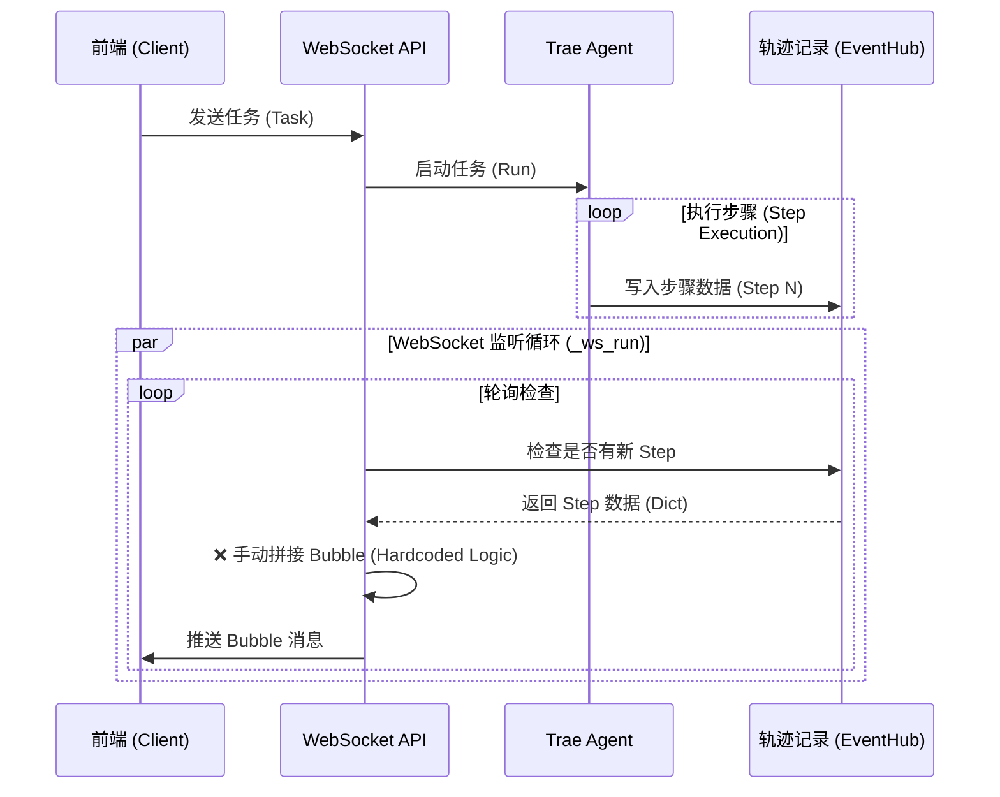
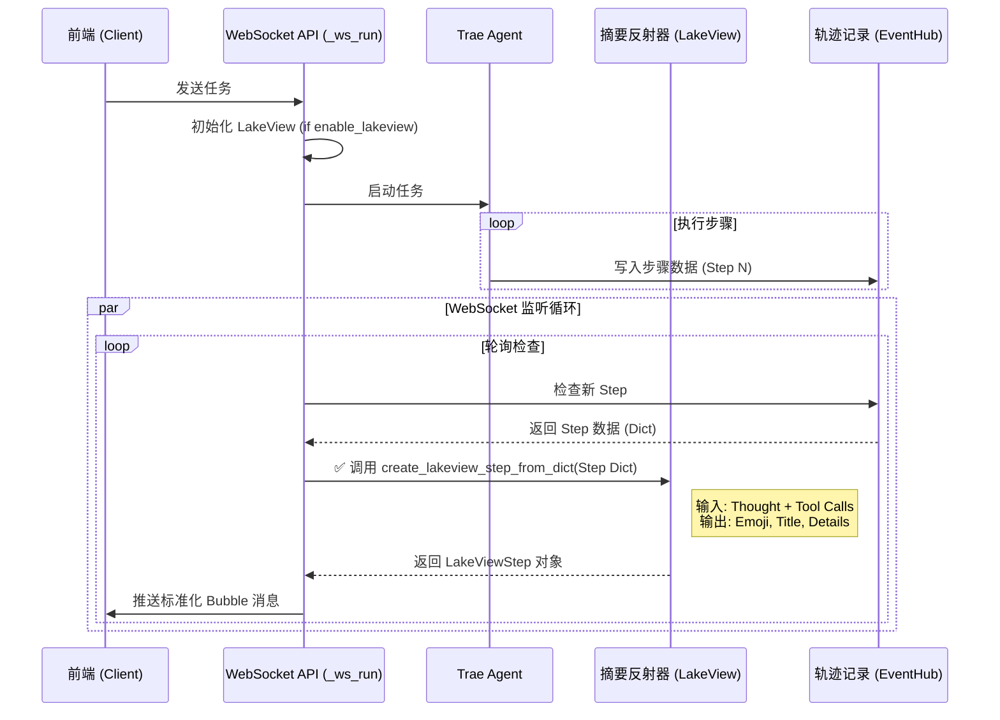

# Lakeview 统一 Bubble 生成改造方案

## 1. 核心目标
解决当前 Bubble 生成逻辑分散、格式不统一、破坏原有设计的问题。
通过统一调用 `LakeView` 组件生成摘要，实现标准化 Bubble 输出，并解耦 CLI 与 API 接口逻辑。

## 2. 核心架构原则
1.  **解耦设计**：API 接口（WebSocket）与 CLI 控制台（Console）互不依赖，平行运行。
2.  **单一事实来源**：Bubble 内容完全由 `LakeView` 组件基于 Agent 执行轨迹（Trajectory）生成。
3.  **配置驱动**：遵循 `enable_lakeview` 配置控制摘要功能的开启/关闭。

## 3. 现有流程与问题分析 (Current Architecture)

### 3.1 当前程序路径
- **WebSocket 接入**: `ws://localhost:8090/ws/agent/interactive/task`
- **处理函数**: `trae_agent/server/main.py` -> `ws_interactive_task` -> `_ws_run`
- **问题**:
    - `_ws_run` 函数内部手动监听 `agent_steps`，手动拼接 Bubble JSON。
    - **未使用** `LakeView` 组件，导致摘要逻辑与 CLI 不一致。
    - **未集成** `enable_lakeview` 配置，导致该配置在 API 模式下失效。
    - 忽略了 `AgentStep` 中的部分语义信息（如 Tags 标签），仅做简单展示。

### 3.2 现有流程图 (Mermaid)



## 4. 改造后架构方案 (Proposed Architecture)

### 4.1 改造核心逻辑
1.  **废弃手动拼接**：在 `_ws_run` 中移除所有手动构造 Bubble 的代码。
2.  **直接集成 LakeView**：在 `_ws_run` 初始化时，根据 `enable_lakeview` 实例化 `LakeView` 对象。
3.  **数据适配**：在 `LakeView` 中增加 `create_lakeview_step_from_dict` 方法，直接处理从 EventHub 读取的字典格式数据。
4.  **标准化输出**：使用 `LakeView` 返回的 `LakeViewStep` 对象（包含 `emoji`, `desc_task`, `desc_details`）构造标准 Bubble。

### 4.2 反射器 (LakeView) 输入数据说明
每次 Step 执行完成后，输入到 LakeView (反射器) 的数据包括：
1.  **LLM 思考过程 (Thought)**: 模型生成的推理内容 (`llm_response.content`)。
2.  **工具调用意图 (Tool Calls)**: 调用的工具名称及参数 (`llm_response.tool_calls`)。
3.  **历史上下文**: 上一步骤的摘要文本（用于生成连贯的任务描述）。
4.  **注意**: 目前 LakeView **不包含** 工具的执行结果 (`tool_results`) 和错误信息 (`error`)，仅基于模型的“思考”与“动作意图”进行摘要。

### 4.4 降级机制 (Fallback Mechanism)
为了应对 `enable_lakeview = False` 的情况，方案将保留并优化原有的手动拼接逻辑作为降级方案。
- **判断逻辑**：在 `_ws_run` 中检查 `lakeview` 对象是否存在。
- **执行逻辑**：如果 `lakeview` 为空，则调用内置的 `_create_fallback_bubble(step_data)` 方法。
- **输出内容**：降级模式下，Bubble 将尽可能还原 `AgentStep` 的原始数据（Thinking, Tool Calls, Results），但不保证拥有 LakeView 风格的 Emoji 和精简摘要。

### 4.5 首个 LLM 响应 (Step 0) 处理
用户提到的“Step 0”通常指 Agent 启动后、执行具体工具前的首次 LLM 隐式推理（即 Step 1 的 Thinking 部分）。
- **现状限制**：`Trae Agent` 目前仅在 Step 完成（工具执行后）才写入 EventHub。因此，无法在工具执行期间“实时”推送 Thinking Bubble。
- **解决方案**：
    - **LakeView 模式**：LakeView 摘要已包含 `desc_details`（详细内容），其中包含了 LLM 的思考过程。Step 1 完成后推送的 Bubble 将自然包含此信息。
    - **降级模式**：`_create_fallback_bubble` 必须显式提取 `llm_response.content` 作为 Bubble 的主要内容，确保用户能看到首次推理结果。

### 4.3 改造后流程图 (Mermaid)



## 5. 具体代码实施步骤

### 步骤 1: 增强 LakeView 组件
**文件**: `trae_agent/trae_agent/utils/lake_view.py`
**修改**: 添加 `create_lakeview_step_from_dict` 方法，使其能处理字典格式的输入（因为 EventHub 返回的是字典而非对象）。

```python
# 伪代码示例
async def create_lakeview_step_from_dict(self, step_data: dict) -> LakeViewStep | None:
    # 1. 构造临时的 AgentStep 对象或 Mock 对象
    # 2. 复用现有的 _agent_step_str 逻辑
    # 3. 调用 extract_task_in_step 和 extract_tag_in_step
    pass
```

### 步骤 2: 重构 WebSocket 监听循环
**文件**: `trae_agent/trae_agent/server/main.py`
**位置**: `_ws_run` 函数
**修改**:
1.  函数入口处初始化 `LakeView`。
2.  在循环处理新 Step 时，增加 if/else 分支处理 LakeView 模式与降级模式。

```python
# 伪代码示例
# 初始化
lakeview = None
if agent.agent_config.enable_lakeview:
    lakeview = LakeView(agent.agent_config.lakeview)

# 循环中
bubble = None
if lakeview:
    # LakeView 模式
    lv_step = await lakeview.create_lakeview_step_from_dict(step_data)
    if lv_step:
        bubble = {
            "type": "bubble",
            "payload": {
                "step_number": sn,
                "emoji": lv_step.tags_emoji,
                "title": lv_step.desc_task,
                "content": lv_step.desc_details,
                "status": "success",
                "timestamp": step_data.get("timestamp")
            }
        }
else:
    # 降级模式 (Fallback)
    # 手动提取 Thinking (Step 0/Implicit Reasoning) 和 Tool Calls
    llm_resp = step_data.get("llm_response", {})
    thought = llm_resp.get("content", "") or step_data.get("thought", "")
    tool_calls = llm_resp.get("tool_calls", [])
    
    # 构造基础 Bubble
    bubble = {
        "type": "bubble",
        "payload": {
            "step_number": sn,
            "emoji": "🤖", # 默认 Emoji
            "title": f"Step {sn}",
            "content": f"{thought}\n\nTools: {[t.get('name') for t in tool_calls]}",
            "status": "success",
            "timestamp": step_data.get("timestamp")
        }
    }

if bubble:
    await _safe_send(bubble)
```

### 步骤 3: 清理旧代码
- 删除 `_ws_run` 中关于 `merged_tool_calls`、`thinking` 内容提取、手动拼接 JSON 的冗余代码。
- 确保 `task_done` 时的最终 Bubble 逻辑也与 LakeView 保持一致（或复用 LakeView 的 Session Summary 功能）。

## 6. 前端适配 (可选)
- 检查前端 `upsertSessionBubble` 是否能正确渲染新的标准化 Bubble 字段。
- 建议前端仅负责渲染，逻辑全部收敛至后端。

## 7. 协议选择 (SSE vs WebSocket)
- **结论**: 继续使用 **WebSocket**。
- **理由**:
    - 当前交互式任务 (`interactive/task`) 需要双向通信（发送指令、接收 Bubble、接收请求输入）。
    - SSE 仅支持单向（Server -> Client），不适合此类强交互场景。
    - WebSocket 已有成熟链路，改造 backend 逻辑即可，无需更换传输协议。
